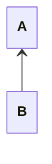
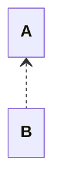
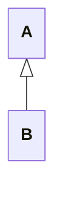
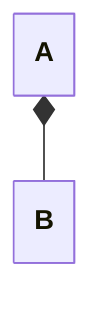
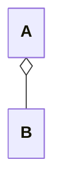

Wann sollte ein Refactoring durchgeführt werden? Welche Aussagen sind richtig und welche falsch.   

repo V1 [SWEN1-LP2019/SWEN1_V1_Wissenssicherung_Verteilte_Systeme_V1.5-V1.6](https://github.zhaw.ch/SWEN1-LP2019/SWEN1_V1_Wissenssicherung_Verteilte_Systeme_V1.5-V1.6)

Frage 6
Wählen Sie eine oder mehrere Antworten:
a. Nach dem Unit-Testing.  
b. Wenn es für eine Iteration eingeplant wurde.
c. Wenn Zeit vorhanden ist.   
d. Am Schluss jeder Iteration.  
e. Wenn ein Code Smell entdeckt wird.

### Pro und Kontra von 3 Vorgehensmodellen
- Code and Fix: schnell und simpel aber schlecht planbar und wartbar
- Wasserfallmodell: gut planbar aber schlechtes Risikomanagement
- Iterativ-inkrementellflexibel, gutes Risikomanagement aber Kunde muss involviert sein und weniger planbar

### Schritte im Angewendetem iterativ-inkrementeller Softwareentwicklungsprozess
0. Erstes Planen
1. Planen
2. Anforderungsanalyse
	- Use Cases
	- Qualitätsanforderungen und Randbedingungen
	- Domänenmodell
3. Design
	- Softwarearchitektur
	- Use Case Realisierung
	- Design Patterns
4. Implemetation
5. Testing
	- Unit Tests
	- Testdokumentation
6. Evaluation oder Deployment

### Was ist Usability und Usability-Engineering?
- Usability: Gebrauchstauglichkeit, wie gut kann ein SW-Produkt eine Aufgabe erledigen?
- Usability-Engineering: hat das Ziel, SW-Produkte zu entwickeln, die effektiv, effizient und zufriedenstellend sind.

### Welche Stufen gibt es innerhalb und ausserhalb von Usability?
1. Brand Experiencem -Customer Experience
2. Desirability -User Experience
3. Usability
4. Utility

### Welches sind die 3 wichtigen Ziele von Usability?
- Effektivität: Die Aufgabe kann mit gewünschter genauigkeit erfüllt werden.
- Effizienz: Der Benutzer kann seine Aufgaben mit minimalem/angemessenem Aufwand erledigen
- Zufriedenheit: Der Benutzer ist mit der Interaktion zufrieden, nicht umberdingt erfreut.

### Was sind 7 wichtige Anforderungsbereiche von Usability?
- Aufgabenangemessenheit
	- Minimale Anzahl Schritte & Eingaben
	- Nur wichtige Informationen
	- Hilfe
- Lernförderlichkeit
	- Informationen zu unterliegenden Konzepten (nur auf Verlangen)
	- Komplexes soll erlernbar sein
	- Aber simples ohne Vorkenntnisse
- Individualisierbarkeit
	- Anpassbarkeit an Know-How, Sprache, Einschänkungen, Kultur
- Erwartungskonformität
	- Konsistenz in Verhalten, Terminologie und Darstellung
- Selbstbeschreibungsfähigkeit
	- Genug Informationen farüber, was zu tun ist und was getan wird
- Steuerbarkeit
	- Alle Benutzeraktionen sollten rückgängig gemacht werden können
	- Aktionen müssen jederzeit abgebrochen werden können
- Fehlertoleranz
	- Einfache Korrektur
	- Kein Datenverlust
	- Hilfe

### Wie sieht der UCD Process aus?

### Ziel und Vorgehen für User & Domain Research
Ziel: Fachdomäne, Business der Firma und Benutzerkontext verstehen

Vorgehen:
- Personas für bestimmte Benutzergruppen
- Contextual Inquiry,  Interviews, Beobachtung, Fokusgruppen, Umfragen, Nutzungsauswertung und Desktop Research
- Usage-Szenarien (= aktuelles Szenario)
- Kontextszenario (=Zukünftliches Szenario)
- Stakeholder-Map
- Geschäftsprozessmodel
- Story-Board
- Mentales Modell
- Wireframes

### Was ist der Umfang eines guten Use-Cases und was gibt es dazu für Tests?
Anforderungen:
- Muss einen konkreten Nutzen für den Akteur erzeugen
- Eine Handlung, die eine Person, an einem Ort zu einer Zeit mit dem System ausführt
- Sollte mehr als eine einzelne Interaktion umfassen
Tests:
- Boss-Test: Dein Boss sollte zufrieden sein, wenn du den ganzen Tag diesen Use-Case ausführst.
- EBP-Test: An einem Ort und and einer Zeit
- Size-Test: Mehr als eine Interaktion, Fully Dressed meist mehrere Seiten

### Was sind die Elemente eines Fully-dressed UC?
- Umfang, Ebene, Primärakteur, Stakeholder und Interessen
- Vor- und Nachbedungungen
- Standardablauf
- Erweiterungen
- Spezielle Anforderungen
- Liste der Technik- und Datenvariationen
- Häufigkeit des Auftretens
- Offene Fragen

### Was ist FURPS+?
 Eine Checkliste für zusätzliche Anforderungen
 - Functionality (Funktionalität): Features, Fähigkeiten, Sicherheit
 - Usability (Gebrauchstauglichkeit)
 - Accessibility (Benutzer mit spez. Bedürfnissen)
 - Reliability (Zuverlässigkeit): Fehlerrate, Wiederanlauffähigkeit, Vorhersagbarkeit, Datensicherung
 - Performance (Performanz): Reaktionszeiten, Durchsatz, Genauigkeit, Verfügbarkeit, Ressourceneinsatz
 - Supportability (Unterstützbarkeit): Anpassungsfähigkeit, Wartbarkeit, Internationalisierung, Konfigurierbarkeit
 - +: Implementation, Interface, Operations, Packaging, Legal

### Was ist der Punkt der Beschreibungsklasse?
Beschreibung soll man in eigenes Konzept stecken, um Redundanz zu vermeiden.

### Was ist der Punkt der Assoziationsklasse?
Wenn etwas via etwas gemacht wird. (So wie Zwischentabelle aber klarer)

### Was ist der Punkt der Komposition?
Wenn X Y enthält und Y nicht mehr existieren würde, wenn X nicht mehr existiert.

### Wie sieht ein Zustand im UML Domänenmodell aus?
X hat den Zustand und die verscheidenen Zustände erben vom Zustand.

### Was ist Software-Architektur?
Gesamtheit der wichtigen Entwurfs-Entscheidungen

### Was sind die Grundlagen der Softwarearchitektur?
- Anforderungen
- Systemkontext mit Schnittstellen

### Was sind die ISO 25010 nichtfunktionalen Anforderungen?
- Functional Suitability
- Reliability
- Performance Efficiency
- Operability
- Security
- Compatability
- Maintainability
- Transferability

### Was sind die Hauptziele der Architektur?
- Erfüllung der Anforderungen und Randbedingungen
- Aufteilung des Gesamtsystems in möglichst unabhängige Teilsysteme

### Wie misst man die Güte einer Modularisierung?
- Kohäsion
- Kopplung

### Was sind die Vorteile von Modulen?
Kapselung und Austauschbarkeit

### Was ist das N+1 View Model?
Es gibt 4 Views im 4+1 Model, diese kann man modellieren:
- Logical View: Welche Funktionalität bietet das System gegen aussen an?
- Process View: Welche Prozesse laufen wo und wie ab im System?
- Development View: Wie wurde die logische Struktur (Layer, Schichten, Komponenten) umgesetzt?
- Physical View: Auf welcher Infrastruktur wird ein System ausgeliefert/betrieben?
- +1: Scenarios, Data View, Security

### Wie sieht das Layered Pattern aus?
Strukturierung eines Programms in Schichten. Die höheren Schichten rufen die unteren auf. Die höheren Schichten sind näher beim Benutzer.

### Wie sieht das Client-Server Pattern aus?
Ein Server stellt Services für mehrere Clients zur Verfügung

### Wie sieht das Master-Slave Pattern aus?
Ein Master verteilt die Arbeit auf mehrere Slaves

### Wie sieht das Pipe-Filter Pattern aus?
Verarbeitung eines Datenstroms (filtern, zuordnen, speichern)

### Wie sieht das Broker Pattern aus?
Meldungsvermittler zwischen verschiedenen Endpunkten (ZB Client <-Broker <-Server)

### Wie sieht das Event-Bus Pattern aus?
Datenquellen publizieren Meldungen an einen Kanal auf dem Event-Bus. Datensenken abonnieren einen bestimmten Kanal. (Der Bus hat Channels. Sources senden Infos und Listeners hören)

### Wie sieht das MVC Pattern aus?
Eine interaktive Anwendung wird in 3 Komponenten aufgeteilt: Model, View – Informationsanzeige, Controller – Verarbeitung der Benutzereingabe (Nur gut für Web-Applikationen, bei denen die gesamte Seite geladen wird)

### Was ist wichtig für Clean Architecture?
- Unabhängigkeit von einem bestimmten Framework, UI, DB(auch Tests)
- Entities kapseln die Business Rules gültig für das gesamte Unternehmen
- Use Cases
- Interface Adapter
- Frameworks und Drivers
- Keine Abhängigkeiten zu externem Code

### Was sind die Nachteile von Frameworks?
- Ansammlung von Funktionalitäten -Inkonsistenz, funktionale Überschneidungen
- Verheiratung von Anwendung und Framework, bei der Schedung mit hohem Aufwand verbunden ist. Lösung wäre noch eine Schnittstelle zwischen dem Framework und der Anwendung.

### Was ist GRASP?
General Responsibility Assignment Software Patterns ist eine Menge grundlegender Patterns
- Information Expert
- Creator
- Controller
- Low Coupling
- High Cohesion
- Polymorphism
- Pure Fabrication
- Indirection
- Protected Variations

### Wie sieht Navigierbarkeit im UML Klassendiagramm aus?

### Wie sieht Abhängigkeit im UML Klassendiagramm aus?

### Wie sieht eine Abstrakte Klasse im UML Klassendiagramm aus?
Entweder ist der Titel Kursiv oder es steht {abstract} dahinter.

### Wie sieht Spezialisierung im UML Klassendiagramm aus?

### Wie sieht Komposition im UML Klassendiagramm aus?

### Wie sieht Aggregation im UML Klassendiagramm aus?

### Wieso nutzt man Patterns?
- Rad nicht neu erfinden
- Gemeinsame Sprache/Verständnis
- Best-practices lernen

### Was gibt es für Gang of Four Patterns?
- Creational Patterns
	- Singleton
- Structural Patterns
	- Adapter
	- Proxy
- Behavioral Patterns
	- Chain of Responsibility

### Wie sieht das Adapter Pattern aus?
Wenn eine (meist externe) Klasse inkopatibel mit dem Interface der Domänenlogik ist, wird ein Adapter dazwischengeschaltet.

### Wie sieht das Simple-Factory Pattern aus?
Es gibt eine eigene Klasse, welche die einzige Aufgabe hat, Instanzen zu erzeugen. Dies macht Sinn, wenn das Erzeugen der Instanz kompliziert ist. Z.B. basierend auf einer Datei.

### Wie sieht das Singleton Pattern aus?
Das Singleton hat eine öffentliche statische Methode, welche immer dasselbe Objekt zurückgibt.

### Wie sieht das Dependency Injection Pattern aus?
Von Aussen wird vom Injector ein Objekt einer Klasse A übergeben. Dieses Objekt hat ein Interface, welches die Klasse A dann nutzt.

### Wie sieht das Proxy Pattern aus?
Ein Stellvertreter Objekt  mit demselben Interface wird anstelle des richtigen Objekts verwendet. Dieses leitet alle Methoden weiter. Die Proxy hat auf das richtige Objekt "subject" Zugriff.
- **Remote Proxy**: Ist ein Stellvertreter für ein Objekt in einem anderen Adressraum und übernimmt die Kommunikation mit diesem.
- **Virtual Proxy**: Verzögert das Erzeugen des richtigen Objekts auf das erste Mal, dass dieses benutzt wird.
- **Protection Proxy**: Kontrolliert den Zugriff auf das richtige Objekt.

### Wie sieht das Chain of Responsibility Pattern aus?
Alle potentiellen Handler sind aneinandergekettet. Eine Anfrage wird immer weitergeleitet, bis sie beim geeigneten Handler angekommen ist. Als Variante wird die Anfrage immer weitergeleitet. Achtung, es könnte kein Handler die Anfrage behandlen.

### Wie sieht das Decorator Pattern aus?
Ein Objekt (nicht eine ganze Klasse) soll mit zusätzlichen Verantwortlichkeiten versehen werden. Ein Decorator, der dieselbe Schnittstelle hat wie das ursprüngliche Objekt, wird vor dieses geschaltet. Der Decorator kann nun jeden Methodenaufruf entweder selber bearbeiten, ihn an das ursprüngliche Objekt weiterleiten oder eine Mischung aus beidem machen. Strukturell ist dies identisch mit dem Proxy Design Pattern, hat aber eine andere Absicht.

### Wie sieht das Observer Pattern aus?
Ein Objekt soll ein anderes Objekt benachrichtigen, ohne dass es den genauen Typ des Empfängers kennt. Ein Interface wird definiert, das nur dazu dient, ein Objekt über eine Änderung zu informieren. Dieses Interface wird vom «Observer» implementiert. Das «Observable» Objekt benachrichtigt alle registrierten «Observer» über eine Änderung.

### Wie sieht das Strategy Pattern aus?
Ein Algorithmus soll einfach austauschbar sein. Der Algorithmus wird dafür in eine eigene Klasse verschoben, die nur eine Methode mit diesem Algorithmus hat. Dann wird ein Interface für diese Klasse definiert, so dass die Klasse mit einer Alternative ersetzt werden könnte.

### Wie sieht das Composite Pattern aus?
Eine Menge von Objekten haben dasselbe Interface und müssen für viele Verantwortlichkeiten als Gesamtheit betrachtet werden. Dafür wird ein ein Composite definiert, das ebenfalls dasselbe Interface implementiert und Methoden an die darin enthaltenen Objekte weiterleitet. Beispiel: Alle Elemente in Spielwelt haben update Methode.

### Wie sieht das State Pattern aus?
Das Verhalten eines Objekts ist abhängig von seinem inneren Zustand. Das Objekt hat ein darin enthaltenes Zustandsobjekt. Alle Methoden, deren Verhalten vom Zustand abhängig sind, werden über das Zustandsobjekt geführt. Beispiel: Pac-Man

### Wie sieht das Visitor Pattern aus?
Eine Klassenhierarchie soll um (weniger wichtige) Verantwortlichkeiten erweitert werden, ohne dass viele neue Methoden hinzukommen. Die Klassenhierarchie wird dafür mit einer Visitor-Infrastruktur erweitert. Alle weiteren neuen Verantwortlichkeiten werden dann mit spezifischen Visitor- Klassen realisiert. (Widerspruch zum Information Expert. Daher wichtige Methoden weiterhin direkt der Klasse hinzufügen.) Use-Cases: Reports, User Interface, Rendering

### Wie sieht das Facade Pattern aus?
Sie setzen ein ziemlich kompliziertes Subsystem mit vielen Klassen ein. Wie können Sie seine Verwendung so vereinfachen, dass alle Team-Mitglieder es korrekt und einfach verwenden können? Eine Facade (Fassade) Klasse wird definiert, welche eine vereinfachte Schnittstelle zum Subsystem anbietet und die meisten Anwendungen abdeckt. Eine Facade kapselt, im Gegensatz zum Adapter, ein Subsystem nicht vollständig ab. Es ist erlaubt, dass die Methoden der Facade Parameter und Rückgabewerte haben, die Bezug auf das Subsystem nehmen.

### Was muss man bei der Fehlerbehandlung beachten?

### Was gibt es für Umsetzungs-Reihenfolgen?

### Was gibt es für Umsetzungsstrategien?

### Was gibt es für Erfolgsfaktoren?

### Was gibt es für Refactoring Patterns?

### Was gibt es für Testarten?
- Funktionaler Test (Black-Box Verfahren)
- Nicht funktionaler Test (Lasttest etc.)
- Strukturbezogener Test (White-Box Verfahren)
- Änderungsbezogener Test (Regressionstest etc.)
- Integrationstest (Nicht nur eine Klasse / Einheit)
- Unit-Test (Nur eine Klasse / Einheit)
- Systemtest (Alle Klassen, mit oder ohne UI)
- Abnahmetest
- Regressionstest

### Was sind verteilte Systeme?
Ein System, welches auf einer Menge voneinander unabhängiger Rechnersysteme basiert. Die Rechnersysteme arbeiten zusammen. Für den Nutzer verhält es sich wie ein nicht verteiltes System.

### Was ist eine verteilte Anwendung?
Eine Anwendung, welche auf einem verteilten System läuft. Es können verscheidene Softwarebausteine auf verscheidenen Rechnern sein.

### Welche Vorteile hat ein verteiltes System?
- Gemeinsamer Ressourcenzugriff
- Lastverteilung
- Ausfallsicherheit, Verfügbarkeit
- Skalierbarkeit
- Flexibilität
- Verteilungstransparenz (Ort, Fehler, Persistenz, ...)

### Welche Phänomene und Probleme ergeben sich bei verteilten Systemen?
- Oft sehr gross
- Sehr datenorientiert: Datenbanken im Zentrum der Anwendung
- Extrem interaktiv: GUI, aber auch Batch
- Sehr nebenläufig: Grosse Anzahl an parallel arbeitenden Benutzern
- Oft hohe Konsistenzanforderungen
- Komplexität durch Verteilung, Netzinfrastruktur
- Sicherheitsrisiken

### Welche Aspekte sind zu berücksichtigen beim Design und der Implementierung eines Client- Server-Systems? 
- **Heterogenität** -Standardformate (Alle Bausteine müssen gleich kommunizieren)
- **Schnittstelle** definieren (auch handling von ungültigen Anfragen)
- **Parallelität**
- **Fehlersituationen**: Es kann u.a. passieren, dass
	- ein Auftrag (engl. request) verloren geht
	- das Ergebnis (engl. reply) des Servers verloren geht
	- der Server während der Ausführung des Auftrags abstürzt
	- der Server für die Bearbeitung des Auftrags zu lange braucht
	- der Client vor Ankunft des Ergebnisses abstürzt.
- **Parameterübergabe**: (von Server zu Client)
	- Call-by-value: Wert wird übergeben
	- Call-by-reference: Verweis auf Variable wird übergeben
	- Call-by-copy/copy-back: Aufrufer arbeitet mit Kopie
		- Synonym: Call-by-restore = Call-by-value-result
- **Marshalling/Unmarshalling** ist das Umwandeln (Serialisierung/Deserialisierung) von strukturierten oder elementaren Daten für die Übermittlung an andere Prozesse. Oder sprachunabhängige Notationen wie JSON, XML
- **Kommunikationsmodell**: Synchron oder asynchron (warten auf response des servers)
- **Namensauflösung** von Directory
- **Zustandsverwaltung**: Soll dies auf dem Server oder Client gespeichert werden? Stateless Server verwalten den aktuellen Zustand der Kommunikationsbeziehung zwischen Client und Server nicht. Damit sind nicht persistente Daten sondern Sessiondaten gemeint. stateless -token für auth
- **Garbage Collection** (Weil Objekt lokal nicht mehr benutzt wird aber remote schon)
- **Lastverteilung, Hochverfügbarkeit**: Server der am wenigsten zu tun hat erhält Request. Wenn Server ausfällt muss an neuen Server geschickt werden oder direkt...
- **Skalierbarkeit**:
	- Horizontal: Steigerung der Leistung durch Hinzunahme von Rechnern
	- Vertikal: Steigerung der Leistung durch Hinzufügen von Ressourcen zu einem Rechner (CPU, Speicher, ...)

### Was sind gängige Technologien (Middleware) zur Entwicklung von verteilten Systemen?
- Socket: TCP, UDP
- RPC (Remote Procedure Call/Verteilte Prozeduraufrufe) ist eine Möglichkeit, Client/Server-Aufrufe zu implementieren.
- Objekt-basierte Kommunikation: Java RMI(Remote Method Invocation) = objektorientierte Umsetzung des RPCs
- WWW, HTTP = zustandslos, unidirektional
- Websockets = bidirektional
- WebServices, REST (Representational State Transfer) = ohne Session, bei jedem Aufruf alles mitgeben/token. Dadurch Skalierbarer.

### Was gibt es für Middleware-Kategorien?
- **Anwendungsorientierte Middleware** Java Enterprise Edition (EE) neu Jakarta EE Spring-Framework .NET Enterprise Services
- **Kommunikationsorientierte Middleware** Remote Procedure Call (RPC), Remote Method Invocation (RMI), REST, WebSocket …
- **Nachrichtenorientierte Middleware** Message Oriented Middleware (MOM), Java Messaging Service (JMS), MQTT …

### Was sind Mehrstufige Architekturen?
Dabei geht es um die Arbeitsteilung zwischen Client und Server. Je nach dem macht der Client einen Teil von Präsentation und Verarbeitung (Domänenlogik). Datenhaltung macht immer der Server. Beispiel: 3 Tier = Datenerhaltung auf Server A, Verarbeitung auf Server B, Präsentation nur beim Client.

